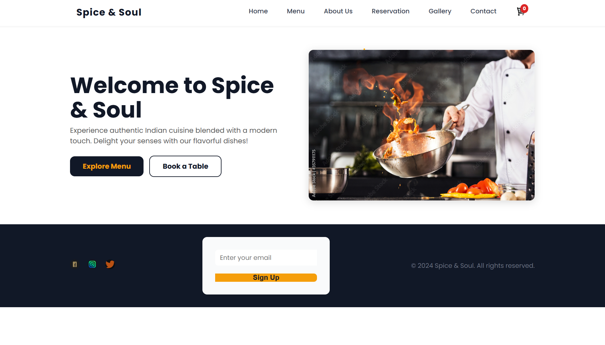
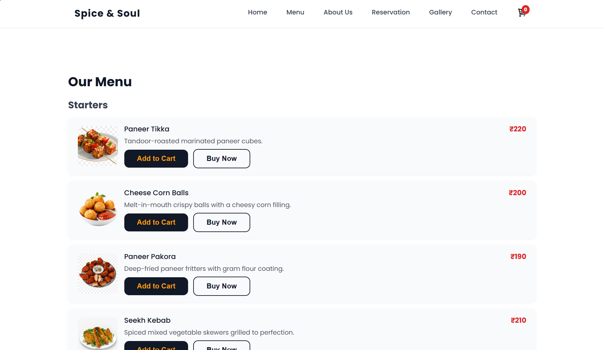
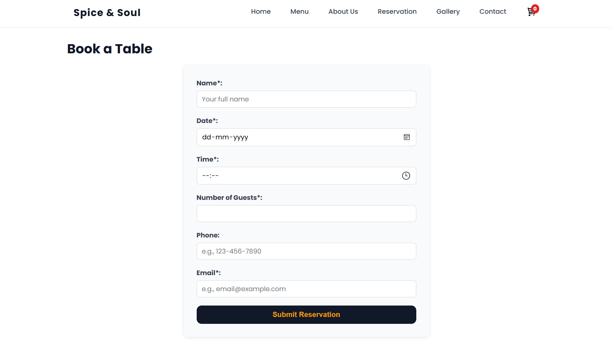
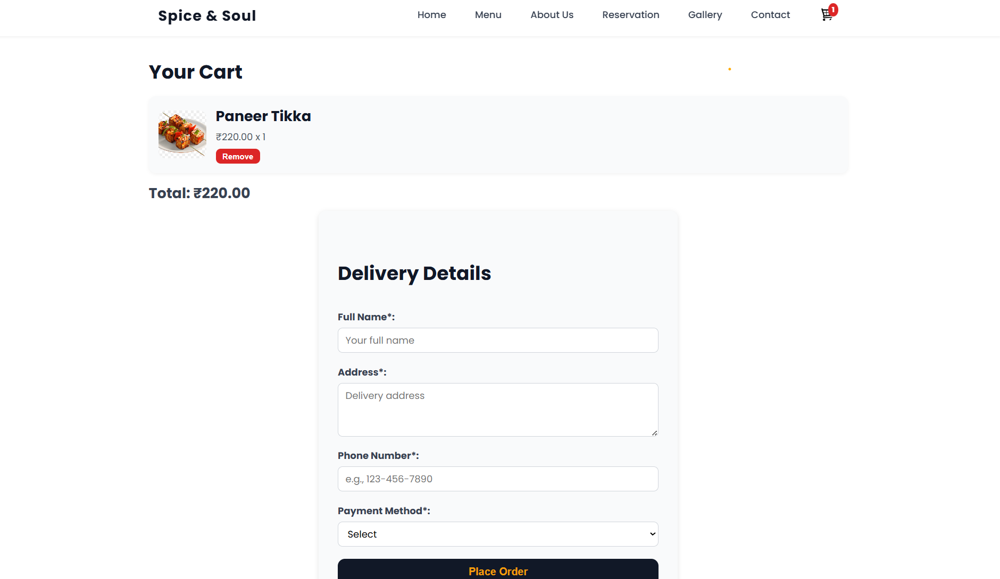

# Spice Soul 🍲

**Spice Soul** is a vibrant and responsive frontend restaurant web application designed to showcase an elegant online presence for a modern restaurant. This static website includes features such as menu display, online reservation, cart and checkout flow, contact and gallery pages.

## Live Preview
You can run this project locally by opening `index.html` in your browser.

---

## 📸 Screenshots

> Replace these with actual screenshots from the project folder after capturing.

### Home Page


### Menu Page


### Reservation Page


### Cart & Checkout


---

## Folder Structure

```
Restaurant/
├── about.html
├── cart.html
├── checkout.html
├── contact.html
├── gallery.html
├── index.html
├── menu.html
├── reservation.html
├── css/
│   └── style.css
├── img/
│   └── [Images and Icons]
└── js/
    └── [Optional JS files]
```

---

## Tech Stack

- **HTML5**
- **CSS3**
- **JavaScript (if used)**
- **Responsive Design** using Flexbox/Grid

---

## Features

- Elegant home page with navigation
- Detailed menu with dish categories
- Reservation booking form
- Shopping cart & checkout flow
- Contact form and location section
- Responsive design for all devices

---
